# Expense Tracker Django

A simple and practical Expense & Income Tracker with an intuitive web interface, REST API, import/export features, and powerful filtering.  
Built with Django, Django REST Framework, and Bootstrap.  
Ideal for learning Django full-stack basics and for personal finance tracking!

---

## Features

- Add, edit, and delete expenses and income entries
- Category & currency management
- Filter and search by type, category, date, currency
- Dashboard with charts and table reports
- REST API for integration and automation
- Admin panel: manage users and all entries, import/export (csv/xlsx/json)
- Simple, clean interface (Bootstrap)

---

## Screenshots

### 1. Django Admin Panel

Manage users, groups, and all entries (expenses/income) in one place.

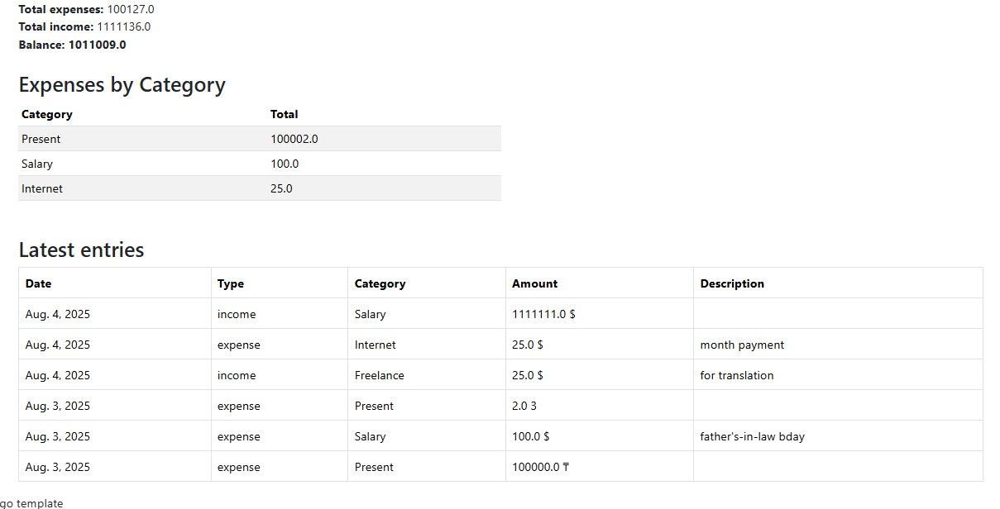

---

### 2. Import Entries

Easily import expenses or income from a file (CSV, XLSX, etc.) via admin panel.

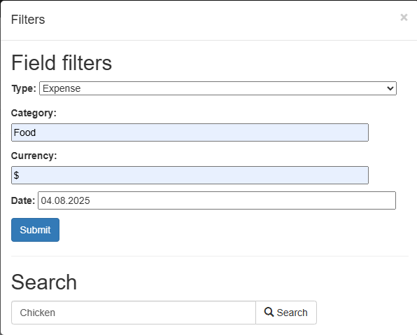

---

### 3. Export Entries

Export your data to various formats for reporting and analytics.

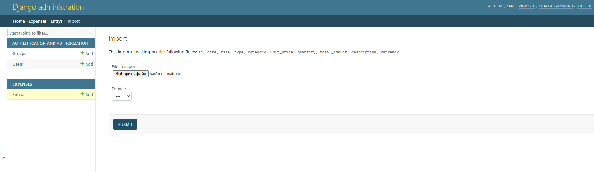

---

### 4. All Entries List

Full history of all operations with filtering options (by type, category, date, etc.).

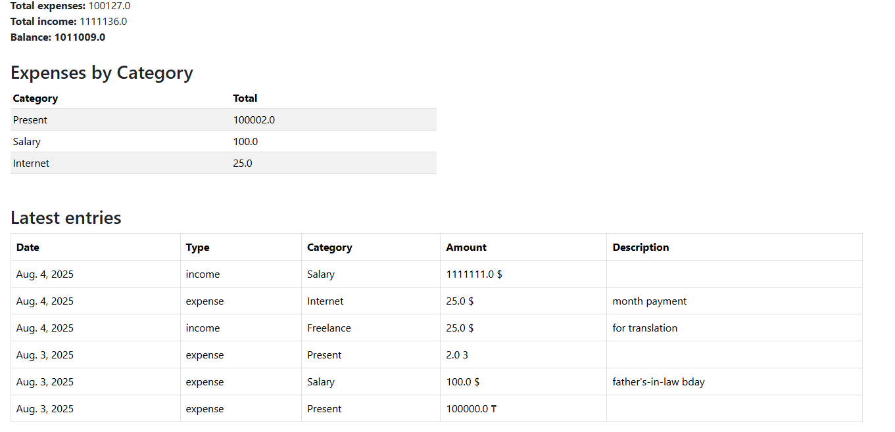

---

### 5. Add New Entry (Web Form)

User-friendly form for manual input of expenses or income.

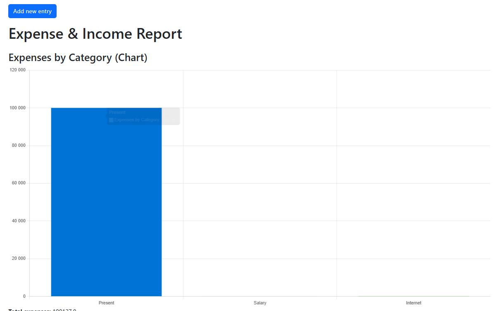

---

### 6. Dashboard – Expense & Income Chart

Visual overview: category-wise expense chart for quick analysis.

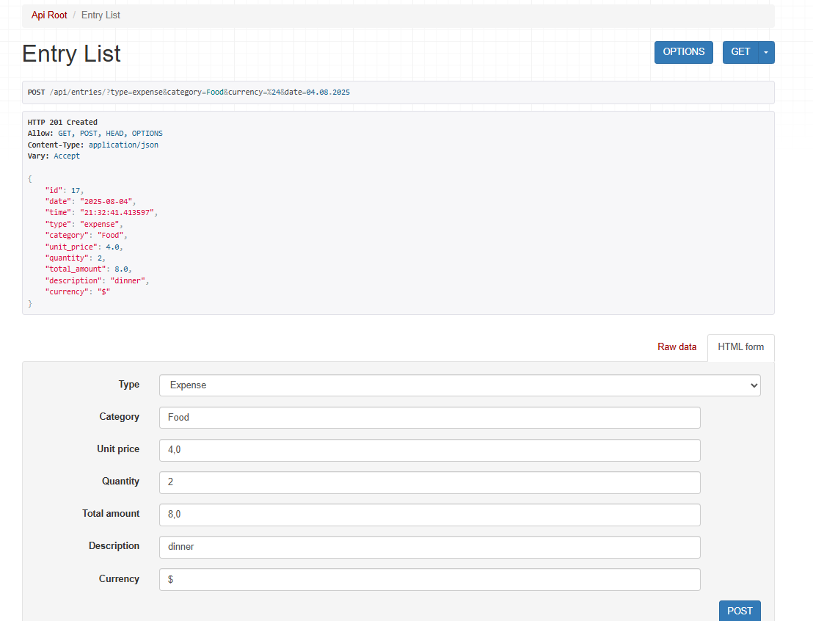

---

### 7. Summary Table & Recent Entries

Table view: all recent transactions, category totals, and current balance.

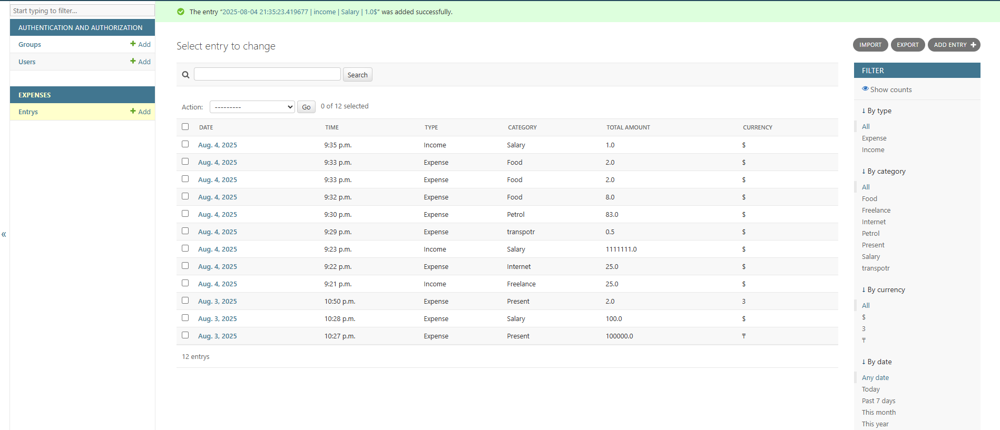

---

### 8. Search by Description

Advanced search: quickly find expenses by keywords (e.g., "Chicken").

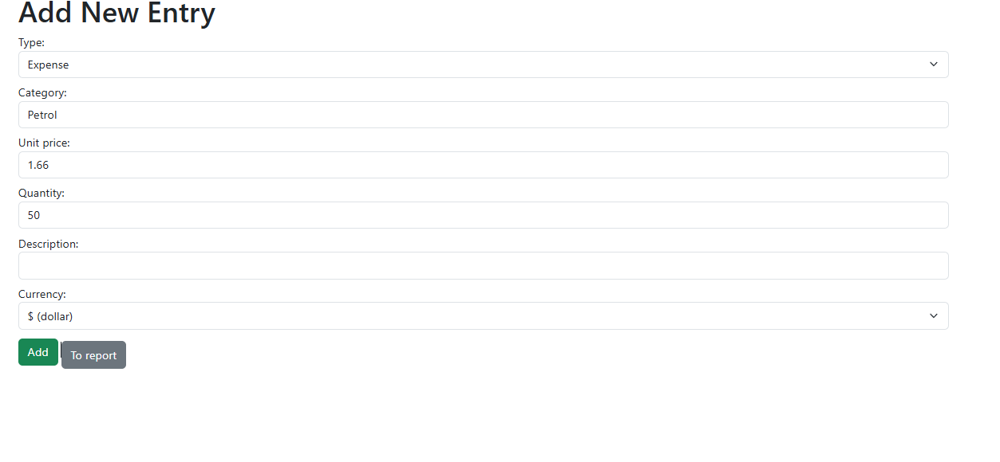

---

### 9. Advanced Filtering

Filter entries by type, category, currency, and date for precise tracking.

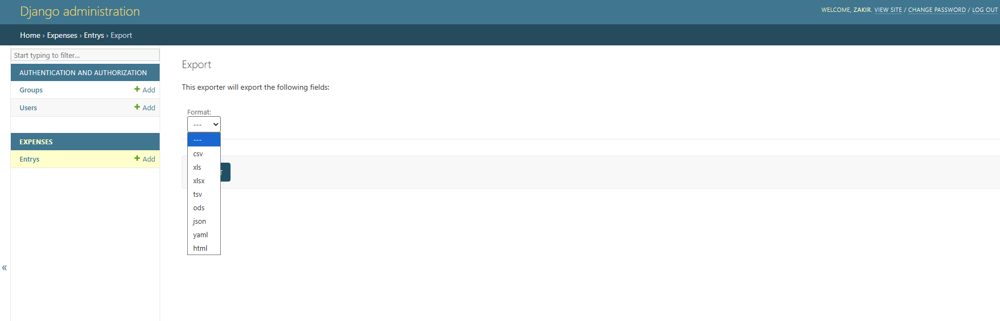

---

### 10. REST API Example

Interact with your data programmatically via the built-in REST API (e.g., add or view entries).

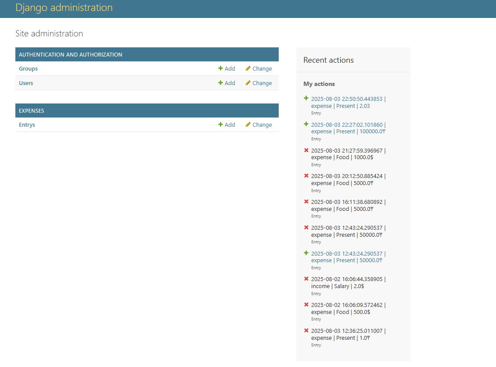

---

### 11. Minimal/Initial State Example

Clean initial dashboard — ready for first entries.

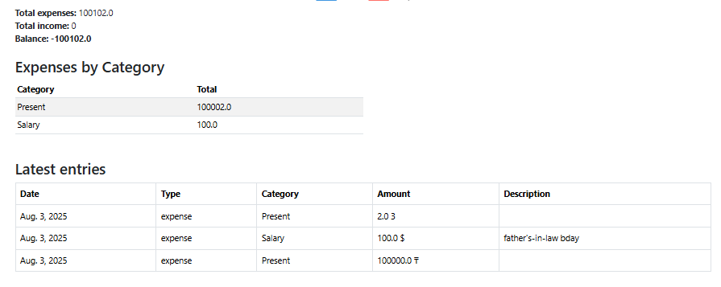
---

## Technologies

- Python 3.11+
- Django 4.x
- Django REST Framework
- django-import-export
- Bootstrap 5

---

## Quickstart (local)

```bash
# 1. Clone repository
git clone https://github.com/yourusername/expense-tracker-django.git
cd expense-tracker-django

# 2. Create virtualenv
python -m venv venv
source venv/bin/activate  # (Linux/Mac)
venv\Scripts\activate     # (Windows)

# 3. Install requirements
pip install -r requirements.txt

# 4. Run migrations
python manage.py migrate

# 5. Create superuser (for admin panel)
python manage.py createsuperuser

# 6. Run server
python manage.py runserver
Open http://127.0.0.1:8000/ in your browser.

API Endpoints
List entries: GET /api/entries/

Create entry: POST /api/entries/

Filter/search: /api/entries/?type=expense&category=Food&currency=$

Full documentation via /api/

License
MIT (or specify your own)

Contacts
Got questions?
LinkedIn: https://www.linkedin.com/in/zakir-izbakiyev-876392197/
Email: pltplz97@gmail.com